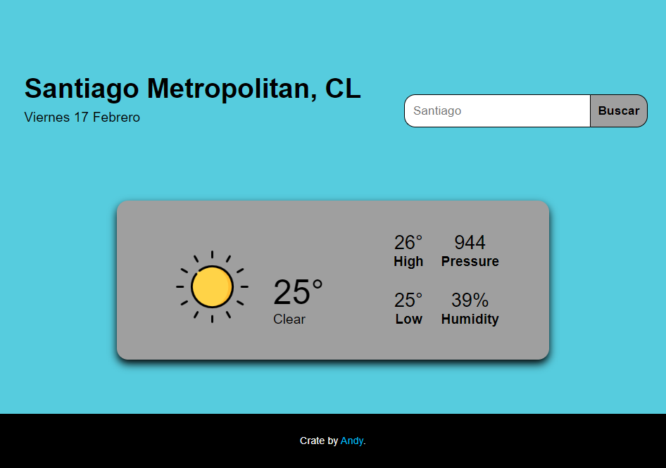

# weather-app
  
A simple page with html, css and js to find out the weather in cities around the world using the [OpenWeatherMap](https://openweathermap.org) page API.
## Licencia
[MIT](https://choosealicense.com/licenses/mit/)